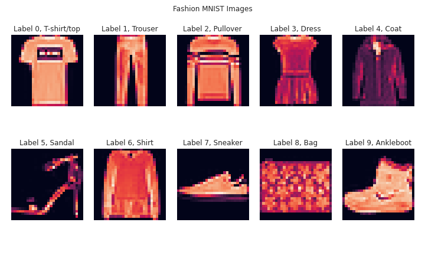
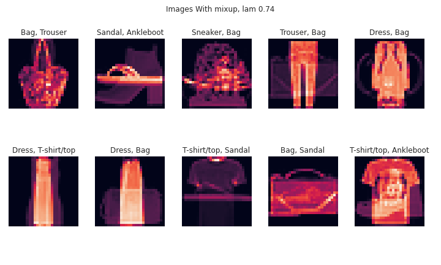
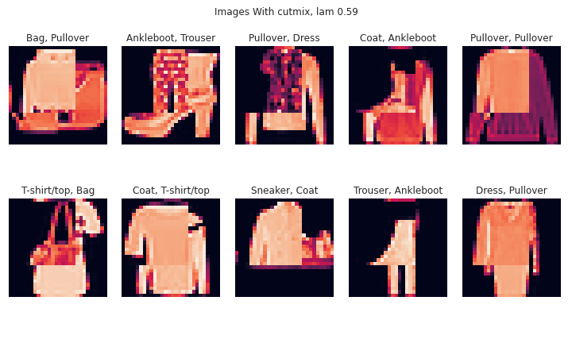
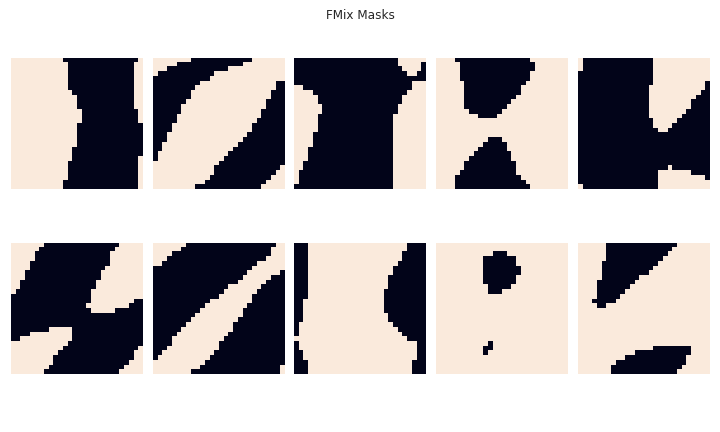
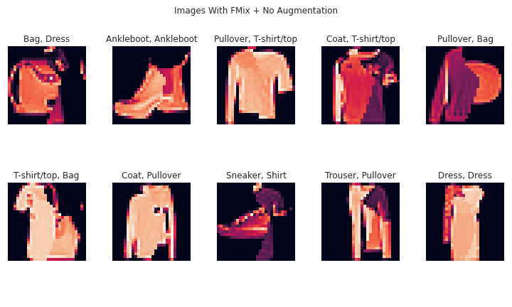
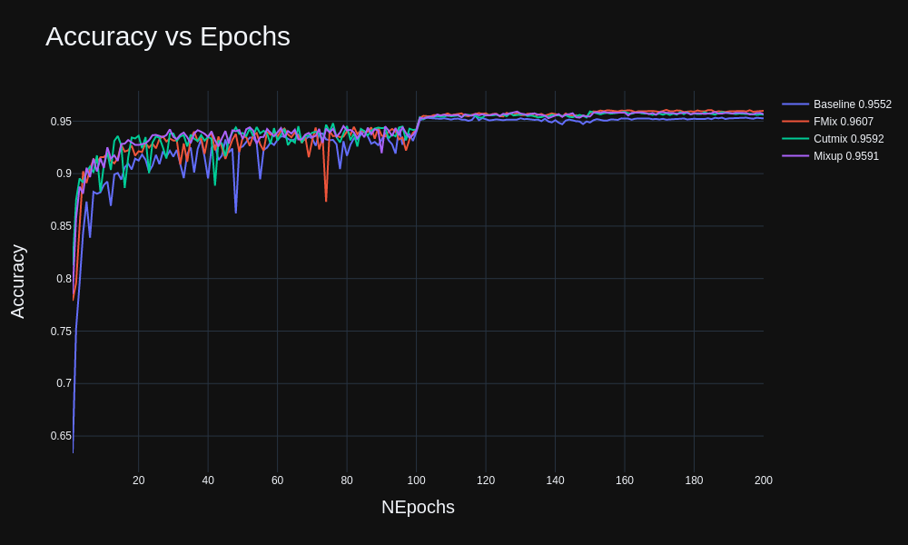
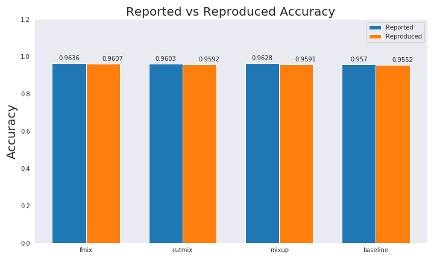

# FMix-Paper-Implementation
In this repo, I have implemented Fmix, Cutmix and Mixup on the Fashion MNIST dataset using PreAct ResNet18. This is an attempt to reprdouce the results from this paper:  https://arxiv.org/abs/2002.12047

# Baseline

# Mixup

# Cutmix

# Fmix

# Accuracy Curve Comparison

# Original vs Reproduced

